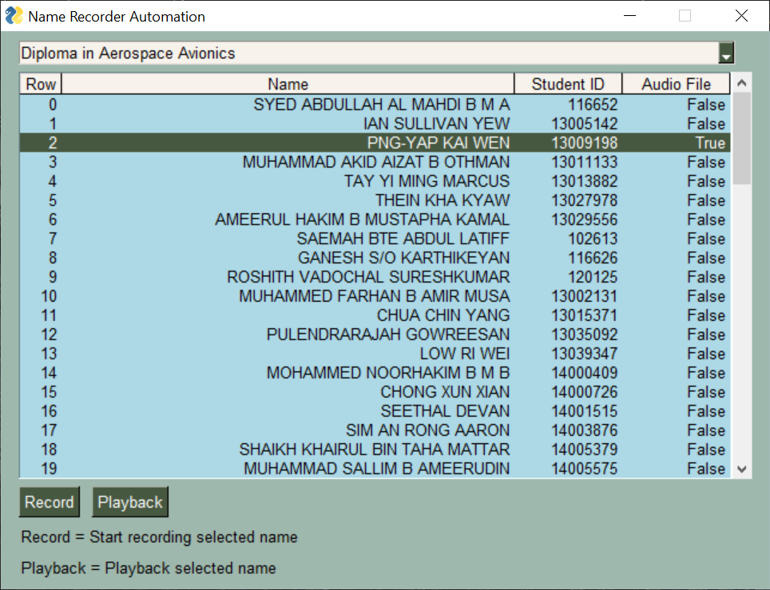

## NameRecorder Automation

---

## EXECUTIVE SUMMARY 
The Name Recorder Automation is an intelligent software agent product that is able to automate record, normalize, add and remove silent padding of sound of student names read by voice talent. 

Republic Polytechnic (RP) deploys a name reader system for graduation ceremonies every year that makes use of pre-recorded student names that will be played as the students go up on stage to receive their diploma certificates. 

The reason for using pre-recorded audio is because when a person is reading hundreds of names live, it is very stressful on the reader to pronounce the name right each time. Mispronouncing the student’s name is embarrassing for both the student and the school. 

Thus, every year before the graduation ceremonies, thousands of student names are pre-recorded and verified by RP staff.
The recording process involves a voice talent who will read and record the names, and an audio technician who post-edits the recordings. This is a very repetitive and error-prone process, with each name taking on average 6 seconds to record, and 60 seconds to post-process. Multiplied by the number of students graduating each year, around 90 man-hours are spent by RP staff on this process. This makes it an excellent candidate for process automation. 

This automation system is able to help RP save manpower costs and also improve the quality and consistency of the name recordings. The benefits include:
1.	Less human errors in post-processing 
2.	Consistency in both volume and silence padding
3.	Manpower savings of 82 man-hours/year

---

## PROJECT CONTRIBUTION

| Official Full Name  | Student ID  | Work Items  | Email  |
| :------------ |:---------------:| :-----| :-----|
| Ng Ziming Vincent | A0213488Y | Requirements Gathering, System Design, GUI, System Integration | e0508589@u.nus.edu |
| Zhou Zhe | A0213542R | Audio Agents Development, Project Reporting | zhouzhe@u.nus.edu |

---

## VIDEO OF SYSTEM MODELLING & USE CASE DEMO

Name Recorder Automation Promotion  

Name Recorder Automation System  

---

## USER GUIDE

`Refer to appendix <Installation & User Guide> in project report at Github Folder: ProjectReport`

### Run the system using Windows 10

1. Download NameRecorder_Automation.zip at: https://github.com/gvinto/ISA-PM-IPA-2021-01-09-IS02PT-GRP-NameRecorder_Automation/releases/download/v0.1/NameRecorder_Automation.zip

2. Unzip and run name_recorder_gui/name_recorder_gui.exe

---
## PROJECT REPORT / PAPER

`Refer to project report at Github Folder: ProjectReport`
